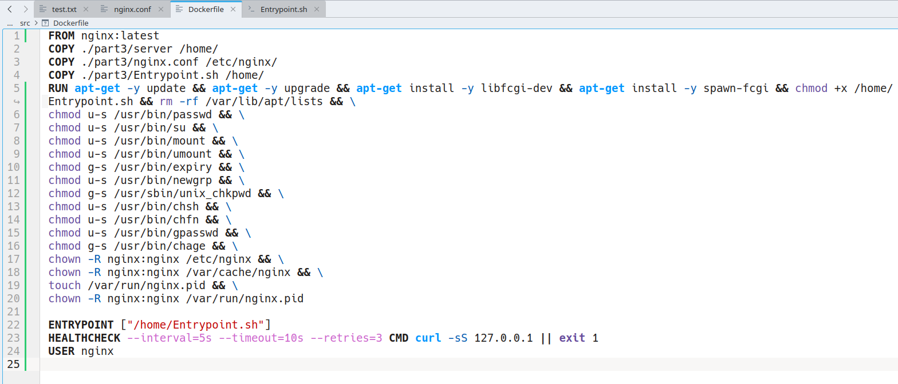

# Simple Docker
## Part 1. Готовый докер
* Возьми официальный докер-образ с **nginx** и выкачай его при помощи `docker pull`.
* Проверь наличие докер-образа через `docker images`.
* Запусти докер-образ через `docker run -d [image_id|repository]`.
* Проверь, что образ запустился через `docker ps`.

_Четыре вышеуказанных пункта на одном скриншоте_

* Посмотри информацию о контейнере через `docker inspect [container_id|container_name]`.
* По выводу команды определи и помести в отчёт размер контейнера, список замапленных портов и ip контейнера.

_Два вышеуказанных пункта на одном скриншоте_

Далее я остановил контейнер и сделал перерыв, поэтому имя контейнера другое. Заново запускаю и иду по пунктам. Далее такое местами будет встречаться.

* Останови докер контейнер через `docker stop [container_id|container_name]`.
* Проверь, что контейнер остановился через `docker ps`.
* Запусти докер с портами 80 и 443 в контейнере, замапленными на такие же порты на локальной машине, через команду *run*.
* Проверь, что в браузере по адресу *localhost:80* доступна стартовая страница **nginx**.
* Перезапусти докер контейнер через `docker restart [container_id|container_name]`.
* Проверь любым способом, что контейнер запустился.

_Шесть вышеуказанных пунктов на одном скриншоте_

- В отчёт помести скрины:
  - вызова и вывода всех использованных в этой части задания команд;
  - стартовой страницы **nginx** по адресу *localhost:80* (адрес должен быть виден).

_Скриншот стартовой страницы nginx_

## Part 2. Операции с контейнером

* Прочитай конфигурационный файл *nginx.conf* внутри докер контейнера через команду *exec*.

_Конфигурационный файл nginx.conf внутри докер контейнера_

* Создай на локальной машине файл *nginx.conf*.

_Скопировал конфигурационный файл nginx.conf из контейнера_

* Настрой в нем по пути */status* отдачу страницы статуса сервера **nginx**.

_Настроил в нем по пути /status отдачу страницы статуса сервера nginx_

Закомментировал инклюд conf.d/default.conf, чтобы всё работало, поскольку по заданию надо менять не его.

* Скопируй созданный файл *nginx.conf* внутрь докер-образа через команду `docker cp`.
* Перезапусти **nginx** внутри докер-образа через команду *exec*.

_Два вышеуказанных пункта на одном скриншоте_

* Проверь, что по адресу *localhost:80/status* отдается страничка со статусом сервера **nginx**.

_Страница со статусом сервера_

* Экспортируй контейнер в файл *container.tar* через команду *export*.

_Экспортирование контейнера в фаил и проверка, что он существует_

* Останови контейнер.
* Удали образ через `docker rmi [image_id|repository]`, не удаляя перед этим контейнеры.
* Удали остановленный контейнер.

_Удаление установленных образа и контейнеров_

* Импортируй контейнер обратно через команду *import*.

_Импорт контейнера из .tar проверка, что он существует_

* Запусти импортированный контейнер.

_Запуск контейнера и проверка, что она прошла успешно_

Поскольку docker export не сохраняет всю информацию (слои образа и метаданные), в отличии от docker save, для запуска необходимо добавить nginx -g 'daemon off;', чтобы nginx работал на foreground контейнера, чтобы контейнер не останавливался сразу после запуска.

* Проверь, что по адресу *localhost:80/status* отдается страничка со статусом сервера **nginx**.

_Страничка localhost:80/status_

## Part 3. Мини веб-сервер

* Напиши мини-сервер на **C** и **FastCgi**, который будет возвращать простейшую страничку с надписью `Hello World!`.

_Мини-сервер на С_

Далее возникли проблемы ввиду того, что в контейнере от образа nginx нельзя вызывать утилиту apt-get. Из-за этого нельзя установить библиотеку fcgi и утилиту spawn-fcgi, которые нужны для работы сервера на FastCgi. Чтобы это обойти, я сделал сборку нового образа на основе nginx с помощью Dockerfile. Прилагаю скриншоты dockerfile и entrypoint.sh, который в нём вызывается.

_Dockerfile, собирающий образ на основе оригинального образа nginx, но с установленными libfcgi и spawn-fcgi_

______________________

_Простой Entrypoint, убирающий необходимость писать фразу на скриншоте руками для корректной работы_

* Запусти написанный мини-сервер через *spawn-fcgi* на порту 8080.

_Сборка образа и запуск контейнера, а так же вызов в нём spawn-fcgi_

* Напиши свой *nginx.conf*, который будет проксировать все запросы с 81 порта на *127.0.0.1:8080*.

_nginx.conf с заданным проксированием. Уже был подгружен в мой образ через dockerfile ранее_

* Проверь, что в браузере по *localhost:81* отдается написанная тобой страничка.

_Написанная страничка по localhost:81_

* Положи файл *nginx.conf* по пути *./nginx/nginx.conf* (это понадобится позже).

Оставил его в src/part3

## Part 4. Свой докер

### Напиши свой докер-образ, который:
* 1) собирает исходники мини сервера на FastCgi из [Части 3](#part-3-мини-веб-сервер);
* 2) запускает его на 8080 порту;
* 3) копирует внутрь образа написанный *./nginx/nginx.conf*;
* 4) запускает **nginx**.

Почти все пункты были (ненарочно) выполнены в предыдущем задании. Остаётся лишь добавить сборку исходников внутри образа (в предыдущем пункте я копировал исполняемый фаил), изменить порт и делать spawn-fcgi при запуске контейнера (в предыдущем задании я это делал через docker exec). Скриншоты изменённого dockerfile и entrypoint.sh. а так же добавил apt-get install gcc, чтобы можно было скомпилировать исходник.

_Dockerfile_

_Entrypoint.sh_

_nginx.conf_

* Собери написанный докер-образ через `docker build` при этом указав имя и тег.
* Проверь через `docker images`, что все собралось корректно.
* Запусти собранный докер-образ с маппингом 81 порта на 80 на локальной машине и маппингом папки *./nginx* внутрь контейнера по адресу, где лежат конфигурационные файлы **nginx**'а (см. [Часть 2](#part-2-операции-с-контейнером)).
* Проверь, что по localhost:80 доступна страничка написанного мини сервера.
* Допиши в *./nginx/nginx.conf* проксирование странички */status*, по которой надо отдавать статус сервера **nginx**.
* Перезапусти докер-образ.
*Если всё сделано верно, то, после сохранения файла и перезапуска контейнера, конфигурационный файл внутри докер-образа должен обновиться самостоятельно без лишних действий*.
* Проверь, что теперь по *localhost:80/status* отдается страничка со статусом **nginx**

_Добавил блок location /status в nginx.conf. На скриншоте ниже будет показано в каком именно месте_

_Вышеизложенные пункты на скриншоте_

## Part 5. **Dockle**

* Просканируй образ из предыдущего задания через `dockle [image_id|repository]`.

_Скриншот с ошибками и предупреждениями_

* Исправь образ так, чтобы при проверке через **dockle** не было ошибок и предупреждений.

_Исправленный Dockerfile_

_Сборка через него и проверка нового образа через dockle и запуск через run_

## Part 6. Базовый **Docker Compose**

* Напиши файл *docker-compose.yml*, с помощью которого:
* 1) Подними докер-контейнер из [Части 5](#part-5-инструмент-dockle) _(он должен работать в локальной сети, т. е. не нужно использовать инструкцию **EXPOSE** и мапить порты на локальную машину)_.
* 2) Подними докер-контейнер с **nginx**, который будет проксировать все запросы с 8080 порта на 81 порт первого контейнера.
* Замапь 8080 порт второго контейнера на 80 порт локальной машины.
* Останови все запущенные контейнеры.
* Собери и запусти проект с помощью команд `docker-compose build` и `docker-compose up`.
* Проверь, что в браузере по *localhost:80* отдается написанная тобой страничка, как и ранее.

Для выполнения этого задания, я сперва скопировал папку /etc/nginx через docker cp из контейнера на основе оригинального образа nginx в src/part6. Единственное, что я там изменил по сравнению с оригиналом-это фаил nginx.conf, чтобы выполнить второй пункт задания с проксированием с 8080 порта nginx на 81 порт первого контейнера. Первый образ остаётся неизменным, как и его Dockerfile, через который он собирается. Порт 8080 второго контейнера мапится на порт 80 локальной машины в docker-compose.yml.

_nginx.conf, который монтируется во второй контейнер через volumes в docker-compose.yml_

___________________________

_Docker-compose.yml_

________________________________

_Вызовы команд `docker-compose build` и `docker-compose up` и проверка работоспособности проекта_
